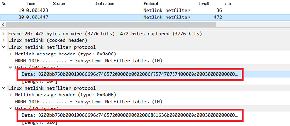

## Netfilter pcap parser 

This is a Netfilter pcap parser made hastily for challenging CTF.

Wireshark (at least v3.6.2) can't read `Netlink netfilter` data and I couldn't find any other tools to parse. This is not perfect but most of the basic types of netfilter pcap can be interpreted.

 


## Requirement

* Python 3
* dpkt


## Demo

* Dragon CTF 2021 [Easy NFT](https://github.com/sajjadium/ctf-archives/tree/main/Dragon/2021/rev/Easy_NFT)

```
# python ./nft-parser.py easynft.pcap 

[#0]
NFT_MSG_GETGEN, family: AF_UNSPEC, version: 0, resource-id: 0

[#1]
NFT_MSG_NEWGEN, family: AF_UNSPEC, version: 0, resource-id: 47989
    + NFTA_GEN_ID: 0xbb75 (len=4)
    + NFTA_GEN_PROC_PID: b'\x00\x00 \n' (len=4)
    + NFTA_GEN_PROC_NAME: nft (len=4)

[#2]
NFT_MSG_GETTABLE, family: AF_UNSPEC, version: 0, resource-id: 0

[#3]
NFT_MSG_NEWTABLE, family: AF_INET, version: 0, resource-id: 47989
    + NFTA_TABLE_NAME: filter (len=7)
    + NFTA_TABLE_FLAGS: 0x0 (len=4)
    + NFTA_TABLE_USE: 0x5 (len=4)
    + NFTA_TABLE_HANDLE: 0x96 (len=8)

[#4]
NFT_MSG_NEWCHAIN, family: AF_UNSPEC, version: 0, resource-id: 0

[#5]
NFT_MSG_GETCHAIN, family: AF_UNSPEC, version: 0, resource-id: 0

[#6]
NFT_MSG_NEWCHAIN, family: AF_INET, version: 0, resource-id: 47989
    + NFTA_CHAIN_TABLE: filter (len=7)
    + NFTA_CHAIN_HANDLE: 0x1 (len=8)
    + NFTA_CHAIN_NAME: input (len=6)
    - NFTA_CHAIN_HOOK
        + NFTA_HOOK_HOOKNUM: 0x1 (len=4)
        + NFTA_HOOK_PRIORITY: 0x0 (len=4)
    + NFTA_CHAIN_POLICY: 0x1 (len=4)
    + NFTA_CHAIN_TYPE: filter (len=7)
    + NFTA_CHAIN_FLAGS: b'\x00\x00\x00\x01' (len=4)
    + NFTA_CHAIN_USE: 0x0 (len=4)
NFT_MSG_NEWCHAIN, family: AF_INET, version: 0, resource-id: 47989
    + NFTA_CHAIN_TABLE: filter (len=7)
    + NFTA_CHAIN_HANDLE: 0x2 (len=8)
    + NFTA_CHAIN_NAME: forward (len=8)
    - NFTA_CHAIN_HOOK
        + NFTA_HOOK_HOOKNUM: 0x2 (len=4)
        + NFTA_HOOK_PRIORITY: 0x0 (len=4)
    + NFTA_CHAIN_POLICY: 0x1 (len=4)
    + NFTA_CHAIN_TYPE: filter (len=7)
    + NFTA_CHAIN_FLAGS: b'\x00\x00\x00\x01' (len=4)
    + NFTA_CHAIN_USE: 0x0 (len=4)
NFT_MSG_NEWCHAIN, family: AF_INET, version: 0, resource-id: 47989
    + NFTA_CHAIN_TABLE: filter (len=7)
    + NFTA_CHAIN_HANDLE: 0x3 (len=8)
    + NFTA_CHAIN_NAME: output (len=7)
    - NFTA_CHAIN_HOOK
        + NFTA_HOOK_HOOKNUM: 0x3 (len=4)
        + NFTA_HOOK_PRIORITY: 0x0 (len=4)
    + NFTA_CHAIN_POLICY: 0x1 (len=4)
    + NFTA_CHAIN_TYPE: filter (len=7)
    + NFTA_CHAIN_FLAGS: b'\x00\x00\x00\x01' (len=4)
    + NFTA_CHAIN_USE: 0x1 (len=4)
NFT_MSG_NEWCHAIN, family: AF_INET, version: 0, resource-id: 47989
    + NFTA_CHAIN_TABLE: filter (len=7)
    + NFTA_CHAIN_HANDLE: 0x4 (len=8)
    + NFTA_CHAIN_NAME: hack (len=5)
    + NFTA_CHAIN_USE: 0x2 (len=4)

[#7]
NFT_MSG_NEWCHAIN, family: AF_UNSPEC, version: 0, resource-id: 0

[#8]
NFT_MSG_GETSET, family: AF_INET, version: 0, resource-id: 0
    + NFTA_SET_TABLE: filter (len=7)

[#9]
NFT_MSG_NEWSET, family: AF_INET, version: 0, resource-id: 47989
    + NFTA_SET_TABLE: filter (len=7)
    + NFTA_SET_NAME: flag (len=5)
    + NFTA_SET_HANDLE: 0x6 (len=8)
    + NFTA_SET_FLAGS: 0x8 (len=4)
    + NFTA_SET_KEY_TYPE: 0x1 (len=4)
    + NFTA_SET_KEY_LEN: 0x1 (len=4)
    + NFTA_SET_DATA_TYPE: 0xed (len=4)
    + NFTA_SET_DATA_LEN: 0x27 (len=4)
    + NFTA_SET_DESC: b'' (len=0)

[#10]
NFT_MSG_NEWCHAIN, family: AF_UNSPEC, version: 0, resource-id: 0

[#11]
NFT_MSG_GETSETELEM, family: AF_INET, version: 0, resource-id: 0
    + NFTA_SET_ELEM_LIST_SET: flag (len=5)
    + NFTA_SET_ELEM_LIST_TABLE: filter (len=7)

[#12]
NFT_MSG_NEWSETELEM, family: AF_INET, version: 0, resource-id: 47989
    + NFTA_SET_ELEM_LIST_TABLE: filter (len=7)
    + NFTA_SET_ELEM_LIST_SET: flag (len=5)
    - NFTA_SET_ELEM_LIST_ELEMENTS
        - NFTA_LIST_ELEM
            - NFTA_SET_ELEM_KEY
                + NFTA_DATA_VALUE: b'\x00' (len=1)
            - NFTA_SET_ELEM_DATA
                + NFTA_DATA_VALUE: b'dnrgs{REDACTEDREDACTEDREDACTEDREDACTED}' (len=39)

[#13]
NFT_MSG_NEWSETELEM, family: AF_INET, version: 0, resource-id: 47989
    + NFTA_SET_ELEM_LIST_TABLE: filter (len=7)
    + NFTA_SET_ELEM_LIST_SET: flag (len=5)
    + NFTA_SET_ELEM_LIST_ELEMENTS: b'' (len=0)
NFT_MSG_NEWCHAIN, family: AF_UNSPEC, version: 0, resource-id: 0

[#14]
NFT_MSG_GETFLOWTABLE, family: AF_INET, version: 0, resource-id: 0
    + NFTA_FLOWTABLE_TABLE: filter (len=7)

[#15]
NFT_MSG_NEWCHAIN, family: AF_UNSPEC, version: 0, resource-id: 0

[#16]
NFT_MSG_GETOBJ, family: AF_INET, version: 0, resource-id: 0
    + NFTA_OBJ_TABLE: filter (len=7)

[#17]
NFT_MSG_NEWCHAIN, family: AF_UNSPEC, version: 0, resource-id: 0

[#18]
NFT_MSG_GETRULE, family: AF_INET, version: 0, resource-id: 0

[#19]
NFT_MSG_NEWRULE, family: AF_INET, version: 0, resource-id: 47989
    + NFTA_RULE_TABLE: filter (len=7)
    + NFTA_RULE_CHAIN: output (len=7)
    + NFTA_RULE_HANDLE: 0x5 (len=8)
    - NFTA_RULE_EXPRESSIONS
        - NFTA_LIST_ELEM
            + NFTA_EXPR_NAME: immediate (len=10)
            - NFTA_EXPR_DATA
                + NFTA_IMMEDIATE_DREG: 0x0 (len=4)
                - NFTA_IMMEDIATE_DATA
                    - NFTA_DATA_VERDICT
                        + NFTA_VERDICT_CODE: b'\xff\xff\xff\xfd' (len=4)
                        + NFTA_VERDICT_CHAIN: hack (len=5)
NFT_MSG_NEWRULE, family: AF_INET, version: 0, resource-id: 47989
    + NFTA_RULE_TABLE: filter (len=7)
    + NFTA_RULE_CHAIN: hack (len=5)
    + NFTA_RULE_HANDLE: 0x7 (len=8)
    - NFTA_RULE_EXPRESSIONS
        - NFTA_LIST_ELEM
            + NFTA_EXPR_NAME: payload (len=8)
            - NFTA_EXPR_DATA
                + NFTA_PAYLOAD_DREG: NFT_REG_1 (len=4)
                + NFTA_PAYLOAD_BASE: NFT_PAYLOAD_TRANSPORT_HEADER (len=4)
                + NFTA_PAYLOAD_OFFSET: 0x1c (len=4)
                + NFTA_PAYLOAD_LEN: 0x8 (len=4)
        - NFTA_LIST_ELEM
            + NFTA_EXPR_NAME: cmp (len=4)
            - NFTA_EXPR_DATA
                + NFTA_CMP_SREG: NFT_REG_1 (len=4)
                + NFTA_CMP_OP: NFT_CMP_EQ (len=4)
                - NFTA_CMP_DATA
                    + NFTA_DATA_VALUE: b'\xddH\xd0\xcf\xd3\x10<\xd4' (len=8)
        - NFTA_LIST_ELEM
            + NFTA_EXPR_NAME: immediate (len=10)
            - NFTA_EXPR_DATA
                + NFTA_IMMEDIATE_DREG: 0x12 (len=4)
                - NFTA_IMMEDIATE_DATA
                    + NFTA_DATA_VALUE: b'\x00' (len=1)
        - NFTA_LIST_ELEM
            + NFTA_EXPR_NAME: lookup (len=7)
            - NFTA_EXPR_DATA
                + NFTA_LOOKUP_SET: flag (len=5)
                + NFTA_LOOKUP_SREG: NFT_REG32_10 (len=4)
                + NFTA_LOOKUP_DREG: NFT_REG_1 (len=4)
                + NFTA_LOOKUP_FLAGS: b'\x00\x00\x00\x00' (len=4)
        - NFTA_LIST_ELEM
            + NFTA_EXPR_NAME: payload (len=8)
            - NFTA_EXPR_DATA
                + NFTA_PAYLOAD_SREG: NFT_REG_1 (len=4)
                + NFTA_PAYLOAD_BASE: NFT_PAYLOAD_TRANSPORT_HEADER (len=4)
                + NFTA_PAYLOAD_OFFSET: 0x3c (len=4)
                + NFTA_PAYLOAD_LEN: 0x27 (len=4)
                + NFTA_PAYLOAD_CSUM_TYPE: 0x0 (len=4)
                + NFTA_PAYLOAD_CSUM_OFFSET: 0x0 (len=4)
                + NFTA_PAYLOAD_CSUM_FLAGS: 0x0 (len=4)

[#20]
NFT_MSG_NEWCHAIN, family: AF_UNSPEC, version: 0, resource-id: 0

[#21]
NFT_MSG_GETGEN, family: AF_UNSPEC, version: 0, resource-id: 0

[#22]
NFT_MSG_NEWGEN, family: AF_UNSPEC, version: 0, resource-id: 47989
    + NFTA_GEN_ID: 0xbb75 (len=4)
    + NFTA_GEN_PROC_PID: b'\x00\x00 \n' (len=4)
    + NFTA_GEN_PROC_NAME: nft (len=4)
```


## References

* Netlink
    * [RFC 3549: Linux Netlink as an IP Services Protocol](https://datatracker.ietf.org/doc/html/rfc3549)
    * [Linux, Netlink, and Go - Part 1: netlink](https://mdlayher.com/blog/linux-netlink-and-go-part-1-netlink/)
    * [Netlink Library (libnl)](https://www.infradead.org/~tgr/libnl/doc/core.html)

* Netfilter
    * [bootlin: /include/uapi/linux/netfilter/nf_tables.h](https://elixir.bootlin.com/linux/v5.16.12/source/include/uapi/linux/netfilter/nf_tables.h)


## License

* MIT License


## Copyright

* Copyright (C) 2022 Hiroki Hada
* All rights reserved.


